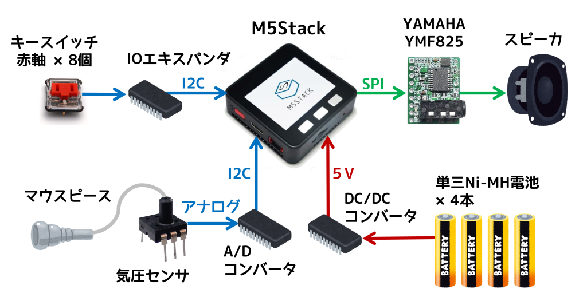
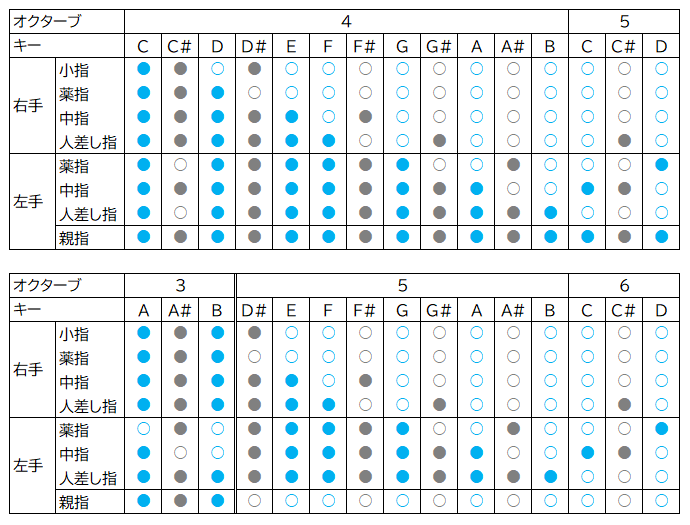

# えれふるす (FM音源ウインドシンセ)

M5StackとヤマハのFM音源チップを使った吹奏楽器です。リコーダーに似た指使いで簡単に吹くことができます。バグパイプにも似た持続音をともなって豊かなハーモニーを奏でるのが特長です。

EleHulusi is a wind instrument with M5Stack and YAMAHA FM synthesizer LSI. It is easy to play like a recorder. It makes rich harmoniy with sustained sounds like a bagpipe.

## システム構成

- M5Stack Basic V2.7 (Battery Bottom は不使用)
- YAMAHA YMF825搭載FM音源モジュール基板 YMF825Board
- ゲージ圧センサ MIS-2500-015G(5V) 
- Kailh Choc V1 ロープロファイルキースイッチ (赤軸)
- MBK Choc ロープロファイルキーキャップ
- 16bit I2C I/OエキスパンダIC MCP23017
- DC/DCコンバータ イーター電機工業 AS6R0-0505 (入力4.5～9V, 出力:5V/1A) 
- スピーカ 8Ω 2W 28mm角 LF-K2828B112A

## コンセプト
中国の民族楽器フルス(葫蘆絲, húlúsī)をモチーフにしたデザインのウインドシンセサイザーです。フルスは、ひょうたんに3本の竹筒がささったような構造をしており、真ん中の竹筒(主管)が指使いによって旋律を奏で、左右の竹筒(副管)は常に一定の音程の持続音を奏でます。これはバグパイプに似た原理で、厚みのあるサウンドを生みます。

えれふるすは、ひょうたんの代わりにペットボトルを、竹筒のかわりにマーブルチョコレートの筒を使って作りました。

## 運指表

- ソプラノリコーダーのドレミファソラシドの指使いを踏襲
- 半音の指使いはやや改変しています。特にC#4は変則的。
- A3～B3も出せるように変則的な指使いを定めています。
- 左手親指を開けると単純に1オクターブ上がります。

## 設定画面

## ソフトウェア
- PlatformIOで開発 (Arduinoベース)
- 依存ライブラリ
    - M5Stack
    - Adafruit MCP23017 Arduino Library
    - SimpleYMF815 (自作ライブラリ)
