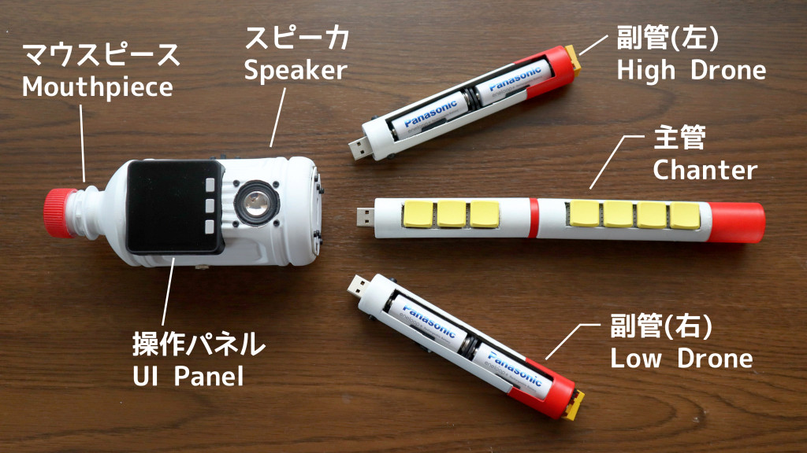
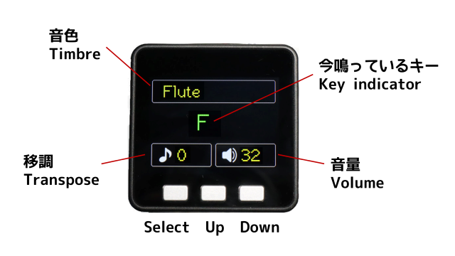
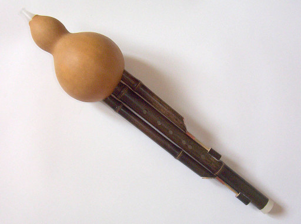

# えれふるす (FM音源ウインドシンセ)

FM音源チップを使った吹奏楽器です。中国のひょうたん笛がモチーフです。  
<!-- A wind synthesizer inspired by the Chinese gourd flute. -->

## 概要

- マウスピースに吹き込んだ息を気圧センサで検出します。
- 主管には8つのキーがあり、リコーダーに似た指使いで演奏します。
- 副管は電池ボックスになっています。また、持続音をON/OFFするスイッチが付いています。
- 右の副管をONするとドの音が、左の副管をONするとソの音が出ます。
- FM音源チップでさまざまな音色を作り、スピーカーに出力します。
- M5Stackの画面とボタンで音色や調(キー)などを設定できます。

<!--
The air pressure sensor detects The breath blown into the mouthpiece. The center pipe has keys to play a melody. Outer pipes have battery boxes and switches that turn on/off the sustained sounds. The FM synthesizer generates various timbres and outputs them to the speaker.
-->

## 構成

- M5Stack Basic V2.7
- ソフトはPlatformIOで開発 (Arduinoベース)
- YAMAHA YMF825搭載FM音源モジュール基板
- ゲージ圧センサ MIS-2500-015G(5V) 
- Kailh Choc V1 ロープロファイルキースイッチ (赤軸)
- MBK Choc ロープロファイルキーキャップ
- 16bit I2C I/OエキスパンダIC MCP23017
- 16bit I2C A/DコンバータIC MCP3425
- DC/DCコンバータ イーター電機工業 AS6R0-0505 <!-- (入力4.5～9V, 出力:5V/1A) --> 
- スピーカ 8Ω 2W 28mm角 LF-K2828B112A

## 操作パネル

- 音色は8種類から選べます。 (Harmonica, Rock Organ, Flute, Church Organ, Harpsichord, Nylon Guiter, Tinkle Bell, Grand Piao)
- 調は-12から＋12まで設定できます。( 0のときC管、+5のときF管となります。)
- ボリュームは0から32まで設定できます。

## コンセプト
中国の民族楽器であるフルス (葫蘆絲, húlúsī) がモチーフです。フルスは、ひょうたん笛とも呼ばれ、ひょうたんに3本の竹の管がささった構造をしています。両サイドの管は和音の効果を担います。これはバグパイプと同様の原理です。

えれふるすは、ひょうたんの代わりにペットボトルを、竹筒のかわりにマーブルチョコレートの筒を使って作りました。そしてフルスの持続音をFM音源の同時発音で再現しました。

<!--
EleHulusi is inspired by the hulusi, a Chinese traditional instrument that is also known as the gourd flute. The hulusi consists of a gourd bottle and three bamboo pipes. The outer pipes make a harmonic effect. It is the same principle as bagpipes.

EleHulusi is made of a plastic bottle and paper pipes instead of a gourd bottle and bamboo pipes. The polyphonic FM synthesizer reproduces the harmonic effect of the hulusi.
-->

 

出典：[Wikipedia](https://ja.wikipedia.org/wiki/%E3%81%B2%E3%82%87%E3%81%86%E3%81%9F%E3%82%93%E7%AC%9B)

## 運指表

- ソプラノリコーダーのドレミファソラシドの指使いを踏襲
- 半音の指使いはやや改変しています。特にC#4は変則的。
- A3～B3も出せるように変則的な指使いを定めています。
- 左手親指を開けると単純に1オクターブ上がります。

