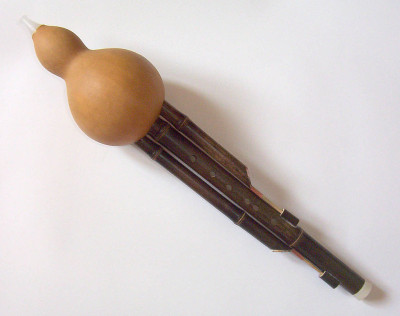
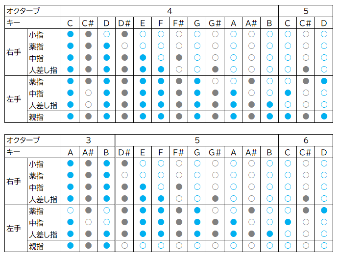

# えれふるす (FM音源ウインドシンセ)

M5StackとヤマハのFM音源チップを使った吹奏楽器です。リコーダーに似た指使いで簡単に吹くことができます。バグパイプにも似た持続音をともなって豊かなハーモニーを奏でるのが特長です。

EleHulusi is a wind instrument with M5Stack and YAMAHA FM synthesizer LSI. It is easy to play like a recorder. It makes rich harmoniy with sustained sounds like a bagpipe.

## システム構成

- M5Stack Basic V2.7 (Battery Bottom は不使用)
- YAMAHA YMF825搭載FM音源モジュール基板 YMF825Board
- ゲージ圧センサ MIS-2500-015G(5V) 
- Kailh Choc V1 ロープロファイルキースイッチ (赤軸)
- MBK Choc ロープロファイルキーキャップ
- 16bit I2C I/OエキスパンダIC MCP23017
- DC/DCコンバータ イーター電機工業 AS6R0-0505 (入力4.5～9V, 出力:5V/1A) 
- スピーカ 8Ω 2W 28mm角 LF-K2828B112A

## コンセプト
中国の民族楽器であるフルス(葫蘆絲, húlúsī)がモチーフです。フルスは、ひょうたんと3本の竹筒からなり、真ん中の竹筒(主管)が旋律を奏で、左右の竹筒(副管)は一定の音程の持続音を奏でます。これはバグパイプと同じ原理で、厚みのある音を生みます。

EleHulusi is inspired by the hulusi that is a Chinese traditional instrument. The hulusi is made of a gourd bottle and bamboo pipes. the center pipe makes a melody, and side pipes makes sustained sounds. It sounds like a bugpipe and works on the same principle.

 

出典：[Wikipedia](https://ja.wikipedia.org/wiki/%E3%81%B2%E3%82%87%E3%81%86%E3%81%9F%E3%82%93%E7%AC%9B)

えれふるすは、ひょうたんの代わりにペットボトルを、竹筒のかわりにマーブルチョコレートの筒を使って作りました。ペットボトルに吹き込んだ息を気圧センサで検出します。主管には旋律を奏でるためのキーを備え、副管には持続音をON/OFFするスイッチと電池ボックスを備えます。FM音源が様々な音色を生み出し、スピーカーに出力します。

EleHulusi is made of a plastic bottle and paper pipes instead of a gourd bottle and bamboo pipes. The air pressure sensor detects the breath blown into the bottle. The center pipe has keys to play a melody. Side pipes have battery boxes and sustained sound output switches. The FM synthesizer produces various timbres and outputs them to the speaker.

## 運指表

- ソプラノリコーダーのドレミファソラシドの指使いを踏襲
- 半音の指使いはやや改変しています。特にC#4は変則的。
- A3～B3も出せるように変則的な指使いを定めています。
- 左手親指を開けると単純に1オクターブ上がります。

## 設定画面

## ソフトウェア
- PlatformIOで開発 (Arduinoベース)
- 依存ライブラリ
    - M5Stack
    - Adafruit MCP23017 Arduino Library
    - SimpleYMF815 (自作ライブラリ)
